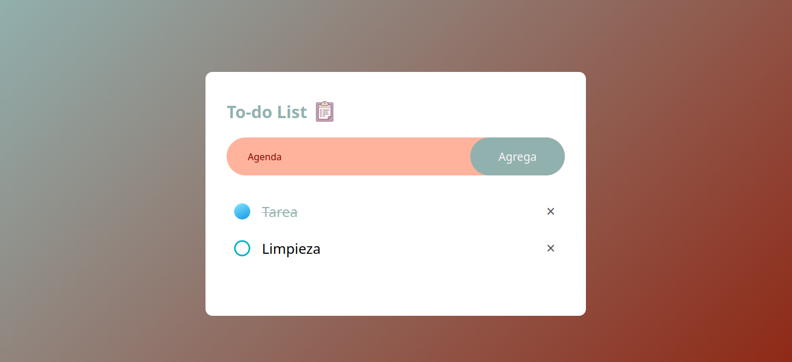

# To-Do App ✅

Aplicación de lista de tareas construida con JavaScript vanilla.

## 🔗 Links

- 🌐 Demo en vivo: [GitHub Pages](https://o0vanfanel0o.github.io/to-do-app/)
- 💻 Repositorio: [GitHub](https://github.com/o0VanFanel0o/to-do-app)

## 📸 Vista previa

## 🛠️ Tecnologías

- HTML5 semántico
- CSS3 — gradientes, border-radius y hover effects
- JavaScript ES6 — arrow functions, DOM manipulation, localStorage

## ✨ Funcionalidades

- Agregar tareas nuevas
- Marcar tareas como completadas
- Eliminar tareas
- Validación de input con trim()
- Persistencia con localStorage — las tareas se guardan al recargar la página

## 🎯 Lo que aprendí

- Manipulación dinámica del DOM con createElement y appendChild
- Manejo de eventos con addEventListener y event delegation
- Persistencia de datos con localStorage
- Validación de inputs con trim()
- Organización de código con arrow functions y const/let

## 👤 Autor

- GitHub: [@o0VanFanel0o](https://github.com/o0VanFanel0o)
